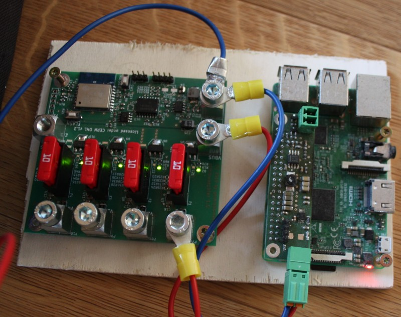

# Stromwaechter
current and voltage monitor and power distribution for 12 V battery systems.

Stromwaechter on the left connected via WiFi to a Raspberry Pi 3 running OpenHAB on the right.

## Introduction

Stromwaechter is a pcb intended for power distribution and monitoring in remote hamradio stations. It has four channels with a dedicated fuse and a switch for each channel. On each channel current and voltage is monitored. The data is collected by an ESP8266 and transmitted via WiFi using the MQTT protocol. The board is intended to be used with a pc running OpenHAB for visualisation and logging but it may also be connected to any MQTT server.

## Hardware

The Stromwaechter has 4 output channels. Each channel can be switched by an Infineon ITS4200S. This IC has an internal over current and short circuit protection. Additionally each channel is protected by an ATO blade fuse. Also each channel has an TI INA226 to measure voltage and current on each channel. This allows to measure current in the range of -4.096 A to +4.096 A.

## Limitations

The stromwaechter PCB is intended to monitor current flowing from the bus connector to loads connected on each channel. It is also possible that current flows in the reverse direction from the output to the bus. In this case the internal short circuit and over current protections of the ITS4200S don't work anymore and there is a 600 mV voltage drop across the ITS4200S because of its internal diode.

## License

The hardware is released under CERN OHL v1.2

## Software

You can find the software on github: https://github.com/generationmake/stromwaechter
The software is released under GPL v3
